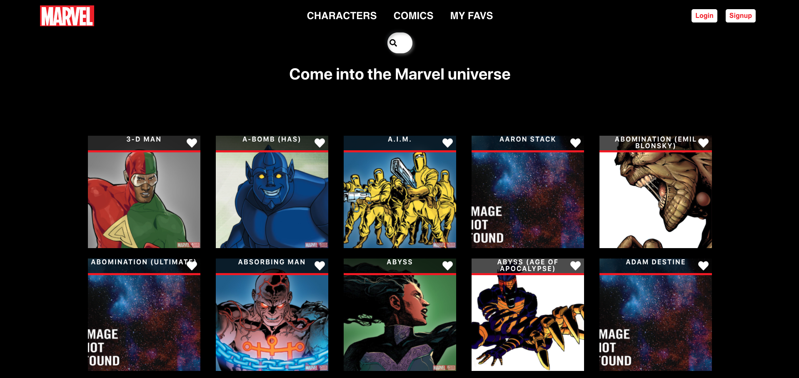

 
 
<h1>Marvel project (Front : React/ Backend : Nodejs)</h1>
 

 Training fullstack project based on the <a href="https://developer.marvel.com/">Marvel Developper API</a>. You can find the Backend code <a href="https://github.com/MaloLebrin/Marvel-Backend"> here</a>.

<h3>

You can find the <a href="https://reverent-wiles-10bc9b.netlify.app/">Live Demo here !</a>

</h3>
 
 

 
<h2 style="color:#ef151e" >Features</h2>
<ul>
  <li>Get the list of all existing comics and characters from the Marvel Universe with dynamic pagination</li>
  
  <li>On a character&apos;s page, get the list of all comics where it appears</li>
  
  <li>On a comic&apos;s page, get the list of character you will find in it</li>
  
  <li>Add characters or Comics to your favlist and find them all on the "Favs" page</li>
 
  </ul>

 
<h2 style="color:#ef151e">Packages used</h2>

<ul>
  <li>React</li>
  
  <li>Axios</li>
  
  <li>React Pagination</li>
  
  <li>React Router Dom</li>
 
  </ul>

 
<h2 style="color:#ef151e">Install</h2>

Just run <code>yarn</code> in your console to install all dependencies and <code>yarn start</code> to launch.

 
 

